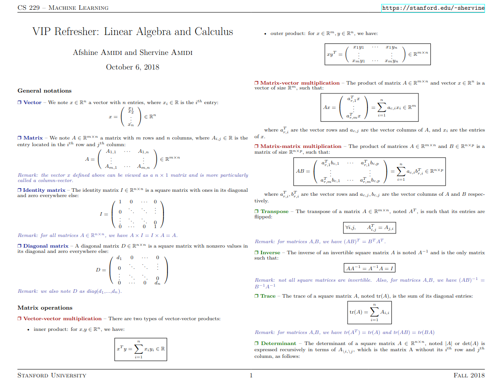

# Linear-Algebra

[Table of Contents](#table-of-contents)  
* [Books](#books)  
* [NPTEL and MOOCs Courses](#course)  
* [Notes](#notes)  
* [Articles](#articles)  
* [Practice Problems](#practice-problems)

>[Download Full Pdf](/Data/Linear-Algebra/refresher-algebra-calculus.pdf)
>
---

## Books

Explore these recommended books to enhance your understanding :

- [**"Introduction to Linear Algebra, 2023 Edition"**](https://math.mit.edu/~gs/linearalgebra/ila6/indexila6.html) by Prof. [Gilbert Strang(MIT)](https://math.mit.edu/~gs/)

- [**"Linear Algebra Done Right, Second Edition"**](https://www.cin.ufpe.br/~jrsl/Books/Linear%20Algebra%20Done%20Right%20-%20Sheldon%20Axler.pdf) by Sheldon Axler
  A comprehensive resource for statistical theory and its applications.

<!--
- [**"All of Statistics: A Concise Course in Statistical Inference"**](https://egrcc.github.io/docs/math/all-of-statistics.pdf) by  Larry Wasserman 
  A comprehensive resource for statistical theory and its applications.
-->
---

## NPTEL and MOOCs Courses

Course to deepen your knowledge:

- [**"Essence of Linear Algebra by 3Blue1Brown"**](https://youtube.com/playlist?list=PL0-GT3co4r2y2YErbmuJw2L5tW4Ew2O5B&si=KFO9uFXnQnFCvevR): A Quick Visual Refresher on Important Concepts of the Linear Algebra. The course gives a great visual understanding of the various facets of linear Algebra
 

- [**"OCW MIT : Linear Algebra by Gilbert Strang"**](https://ocw.mit.edu/courses/18-06-linear-algebra-spring-2010/video_galleries/video-lectures/) : Linear Algebra Course MIT
- [**"Linear Algebra Course at Khan Acadmey"**](https://www.khanacademy.org/math/linear-algebra) : Khan Academy Course 

---

## Notes

Review these comprehensive notes to reinforce your grasp :

- [**Short Notes Linear Algebra by Prof. Gilbert Strang**](https://ocw.mit.edu/courses/res-18-010-a-2020-vision-of-linear-algebra-spring-2020/13c014d45cb504519389d6640e673ba4_ZoomNotes_18-010.pdf)
ZOOMNOTES FOR LINEAR ALGEBRA : GILBERT STRANG Massachusetts Institute of Technology

- **[Linear Algebra Review for Machine Learning ](https://www.cse.iitd.ac.in/~parags/teaching/col774/review/linalg.pdf)**
  From COL774: Machine Learning (IIT D) by Prof. [Parag Singla](https://www.cse.iitd.ac.in/~parags/teaching.html)

---

## Articles

Read insightful articles  to gain additional insights:

- [**Linear Algebra Important Points on Gate Overflow**](https://gateoverflow.in/blog/8877/linear-algebra-important-points)

---

## Practice Problems

Test your knowledge and skills with these practice problems:

- [**Previous Years GATE Linear Algebra Problems**](https://www.geeksforgeeks.org/linear-algebra-gq/) : Geeks for Geeks
- [**Linear Algebra Questions**](https://gateoverflow.in/tag-search-page?q=linear-algebra+) : Gate Overflow

---

#### Table of Contents

* [Books](#books)  
* [NPTEL and MOOCs Courses](#course)  
* [Notes](#notes)  
* [Articles](#articles)  
* [Practice Problems](#practice-problems)

